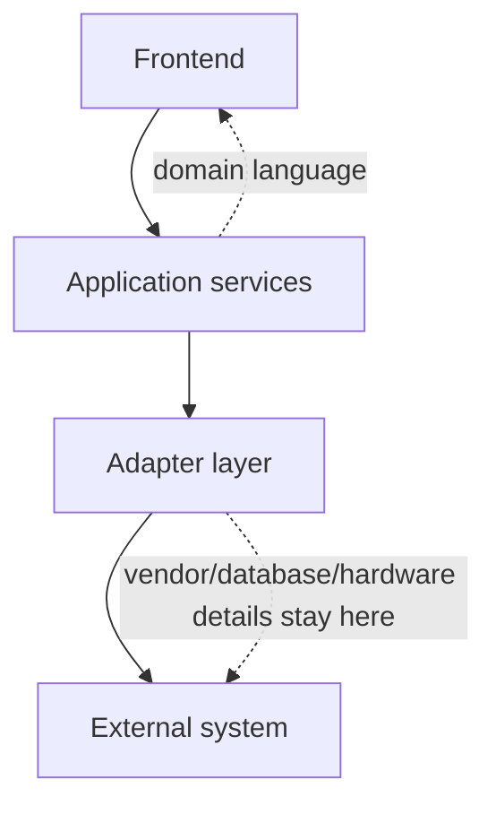
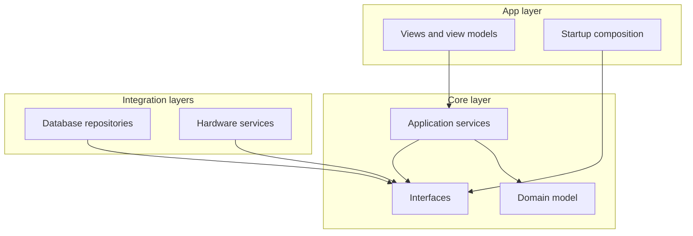
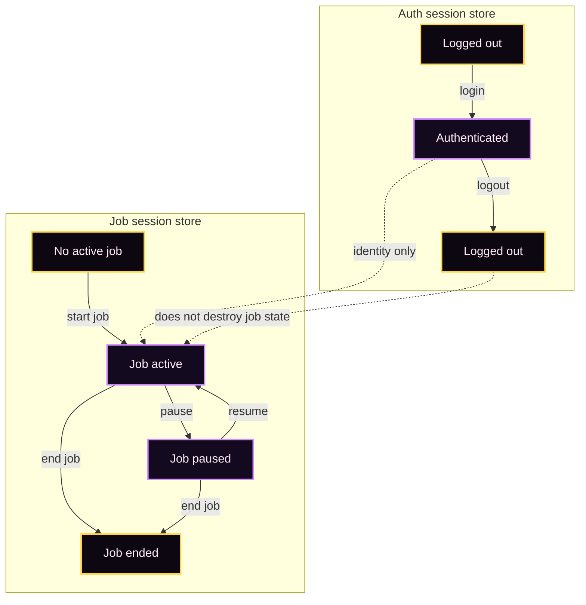
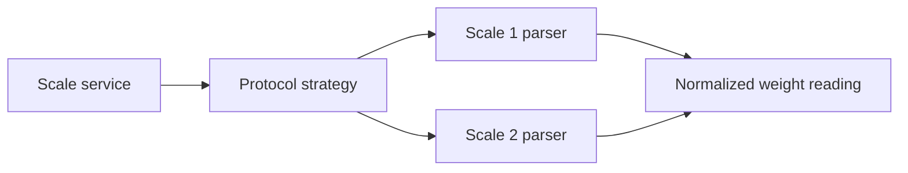
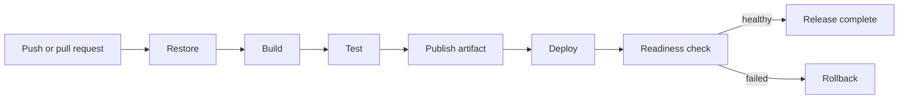
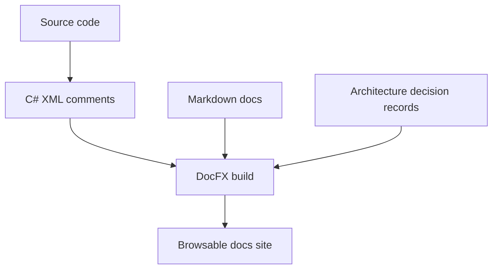

After graduating in May of 2025 with my bachelor's degree in computer science, I finally found a software engineering job! I started working at a local manufacturing company as a full-stack engineer in March of this year. I have been writing [C#](https://learn.microsoft.com/en-us/dotnet/csharp/) almost exclusively, mostly on internal tools that connect manufacturing workflows to existing business systems, particularly involving automating data entry.

This post was originally going to be a general recap of what I have learned so far, but I think the more interesting thing is the [design patterns](https://refactoring.guru/design-patterns) I have actually used. School teaches design patterns in a very abstract way. At work, they show up naturally because a system has pressure on it. As I've been creating applications for this company, I've been building modular systems in order to *extend* user functionality instead of breaking it.

So here are the patterns I have been using the most.

<figure>
  
  <figcaption>Having a pretty dev environment is necessary.</figcaption>
</figure>

---

## Adapter layers around external systems

The most important programming paradigm I have used is [encapsulation](https://learn.microsoft.com/en-us/dotnet/csharp/fundamentals/tutorials/oop).

A lot of my work has involved integrating with an [ERP system](https://www.sap.com/resources/what-is-erp) and other existing databases. I do not control those systems, and I do not want their details leaking across the rest of the application. For one project, I created the backend for a web app to interface with existing ERP software. I ended up treating the ERP integration as its own layer. [Controllers](https://learn.microsoft.com/en-us/aspnet/core/mvc/controllers/actions?view=aspnetcore-9.0) talk to application services, application services talk to integration services, and the integration services are the only place that know how to communicate with the external system.

That sounds obvious, but it matters a lot. If database queries, authentication calls, and weird vendor-specific assumptions are allowed to spread everywhere, the app becomes hard to test and even harder to change. By encapsulating those details behind service interfaces, the rest of the application can talk in terms of internally derived data classes rather than raw external-system behavior.

I used the same idea in a desktop application I am currently developing with WPF, but with hardware. The app needs to work with barcode scanners, serial scales, and label printers. Instead of letting the UI know about serial ports or printer transports directly, those details live behind hardware abstractions. The app can consume "a scale service" or "a label printer" without caring whether the current implementation is real hardware or a simulated device for development.

The pattern is basically: isolate everything you do not own.

Adapter layers keep the app speaking in its own domain language while the messy external-system details stay boxed in.

---

## Layered architecture with dependency direction

The current project I'm working on pushed me to think harder about dependency direction. It is a [WPF](https://learn.microsoft.com/en-us/dotnet/desktop/wpf/overview/) desktop application, but I did not want it to become one giant UI project with database calls and hardware calls mixed into view models.

The structure I landed on is layered:

- the app layer owns WPF views, [view models](https://learn.microsoft.com/en-us/dotnet/communitytoolkit/mvvm/), controls, and UI-specific services
- the core layer owns domain models, application services, workflow state, exceptions, DTOs, and interfaces
- the database integration layer implements repository interfaces for the external database
- the hardware layer owns scale, scanner, and printer implementations

The important part is not just having folders or projects. The important part is enforcing the dependency rule. Core depends on **nothing**. The database layer and hardware layer depend **inward** toward core, not sideways toward each other. The app composes everything at startup.

That pattern has been useful because it prevents accidental coupling. A view model should not know how a SQL query is shaped. A database repository should not know how a scale works. If those boundaries are respected, each piece is easier to test and replace.

The WPF app is split so UI, domain logic, database integration, and hardware do not all know about each other. The magic of ✨ encapsulation ✨

---

## Thin controllers and service-owned behavior

For the APIs I've developed here, I try to keep controllers thin. The controller should validate the request shape, call the correct service, and return the response. It should not become the place where business rules, database access, and error handling all pile up.

This has made the codebase easier to reason about. Authentication has its own service. Session lifecycle rules have their own service. External lookups and writes have their own integration services. Error translation happens through [middleware](https://learn.microsoft.com/en-us/aspnet/core/fundamentals/middleware) instead of being manually repeated across every endpoint.

The pattern is not exciting, but it is effective (which in my opinion, makes it kinda exciting..)

---

## State ownership as a design decision

One of the larger systems I worked on manages active job sessions. That forced me to think about state as a first-class design problem.

The pattern I used was to separate different kinds of state into different stores. User authentication sessions and active job sessions are related, but they are not the same thing. Logging out should not automatically mean destroying every piece of job state. A job session has its own lifecycle, its own ownership rules, and its own recovery concerns.

That separation made several system rules clearer:

- authentication proves who is making the request
- job-session state describes what production work is currently active
- ownership changes should be explicit
- recovery logic should not depend on a user actively clicking something

The main lesson is that state boundaries matter as much as class boundaries. If two pieces of state have different lifecycles, they probably should not be modeled as one thing.

Auth state and job state are related, but they have separate lifecycles and separate cleanup rules. The magic of ✨ encapsulation ✨ x2!

---

## Repository and transaction boundaries

Working with existing SQL databases has made repository boundaries feel practical rather than academic. For the WPF app, the core layer defines [repository interfaces](https://martinfowler.com/eaaCatalog/repository.html) around jobs, inventory, locations, master lots, labels, and transaction writes. The database layer implements those interfaces. This lets the control flow and validation services depend on concepts instead of query details.

The [transaction](https://learn.microsoft.com/en-us/sql/database-engine/sql-database-engine?view=sql-server-ver17#database-fundamentals-acid-compliance) boundary is just as important. Some workflows have multiple steps where one operation may succeed and a later operation may fail. In those cases, the design has to decide what is safe to retry. Retrying an entire workflow can duplicate a write. Retrying only the failed operation can preserve the successful work and give the user a clean recovery path.

That pushed me toward explicit transaction services, deterministic identifiers where useful, and designs where a failed downstream step does not automatically mean replaying everything from the beginning.

<figure>
  
  <figcaption>Having an abstraction to handle your queries is immensely helpful.</figcaption>
</figure>

---

## Strategy pattern for hardware protocols

The scale integration for my WPF app is one of the clearest examples of a classic design pattern becoming useful in real life.

Different scale manufacturers can send different serial formats. Even when the transport is the same, the protocol is not. Instead of baking one parser into the scale service, the app separates the serial transport from the protocol parser. The scale service reads data, while the selected protocol knows how to interpret it.

That is basically the [strategy pattern](https://refactoring.guru/design-patterns/strategy). The app can swap protocol implementations without rewriting the whole scale service. It also makes testing easier because the parser can be tested independently from the serial port.

The same general idea shows up in printing. Label printing uses a stable printer abstraction while the transport can vary. The app should not care whether the final printer is reached through one mechanism or another. It should care that a label print was requested and whether that request succeeded.

The scale service owns the connection, while protocol strategies turn device-specific output into one normalized reading.

---

## Simulated implementations for development

One pattern I did not appreciate enough before working as a software engineer is simulation as an intentional design feature.

If an app depends on a scale, scanner, printer, or production database, development gets painful unless every dependency can be replaced locally. For hardware especially, simulated implementations are not just nice to have. They let the app be built and tested when the real device is unavailable.

The key design choice was making simulation configurable per device instead of treating the whole app as either "real" or "fake." You might want a real scale but a simulated printer. Or a simulated scale while testing the database integration. That flexibility only works if the abstractions are clean.

This pattern has made me think about testability at the system level, not just the unit-test level. And by thinking about how testing works between systems, I have become a better engineer.

---

## Centralized error shaping

I have used centralized error handling in every major project I have built at my job.

In the APIs, typed exceptions flow into middleware that turns them into consistent HTTP responses. That keeps controllers from repeating the same try/catch and response-building logic. It also gives the frontend a predictable error shape instead of a random mix of status codes and messages.

In the WPF app, domain and infrastructure errors are represented in a way the UI can render consistently. Instead of every screen inventing its own error behavior, errors become structured information with severity, message, and action hint. The UI can then display those errors through a shared status component.

The design pattern is the same in both places: errors should cross boundaries in a deliberate shape. Internal exceptions are for the application. API responses and UI messages are for users and clients. Mixing those concerns makes systems harder to support.

---

## CI/CD as a design pattern

The [CI/CD pipeline](https://docs.github.com/actions/deployment/about-continuous-deployment) has also become part of the system design, not just a deployment convenience.

For the production API, the pipeline follows a pattern:

- restore dependencies
- build in release mode
- run tests
- publish an artifact
- deploy from the artifact on a self-hosted Windows runner
- inject environment-specific settings from secrets
- restart the IIS app pool
- run a readiness check
- roll back if the health check fails

There are separate flows for test and production environments, and deployments are serialized so two runs do not step on each other. Pull requests can build and test without deploying. Pushes to the right branch can promote the artifact into the matching environment.

The important design idea is that deployment should be repeatable and idempotent. Secrets should not live in source control. The build output should be packaged once and deployed intentionally. A deployment should prove the app is alive afterward. If it cannot prove that, rollback should be part of the process instead of a panic button someone has to invent during an outage.

I did not think of CI/CD as a "design pattern" before, but it is. It is the release architecture of the application.

The deployment pipeline treats build, deploy, health check, and rollback as one repeatable system.

## Documentation as architecture

I have also been using documentation as part of the architecture, not as a separate afterthought.

The larger projects have documentation systems built with Markdown, diagrams, architecture notes, ADRs, and generated API references. [DocFX](https://dotnet.github.io/docfx/) is used to generate browsable documentation from both handwritten docs and C# API metadata. The docs pipeline builds and deploys the documentation site separately, which means the architecture notes can live with the code and still be easy to read.

<figure>
  
  <figcaption>How my docs look like at work (docs rule!)</figcaption>
</figure>

The most useful documentation patterns have been:

- architecture overviews that explain system boundaries
- request-flow [diagrams](https://mermaid.js.org/syntax/flowchart) that show how components interact
- [ADRs](https://adr.github.io/) that record why a decision was made
- setup guides for local development and deployment
- generated API references for public classes and endpoints
- operational notes for production support

ADRs have been especially helpful. A decision like "use WPF instead of a web app" or "keep hardware behind abstractions" has tradeoffs. Writing the tradeoffs down makes future changes easier because the next person can see the reasoning instead of guessing from the final code shape.

The pattern is simple: if a design decision affects future work, document the decision near the code.

The documentation site is generated from both handwritten architecture docs and API metadata that lives with the source code.

## What I am taking from all of this

The biggest thing I have learned is that design patterns are most useful when they respond to real pressure.

Adapters matter when the external system is weird. Layering matters when the app talks to UI, hardware, and databases at the same time. Centralized errors matter when users and frontends need predictable failure behavior. CI/CD matters when deployment mistakes can interrupt real work. Documentation matters when the system is too large to keep in one person's head.

I still have a lot to learn, but I am starting to understand why software architecture exists. It is not about making a diagram pretty. It is about making the system understandable enough that it can survive change.

Also, yeah. I still did not expect to learn this much SQL x3
